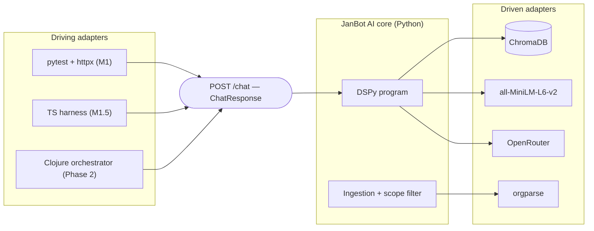

# Architecture Spine — JanBot

## Design Paradigm

Ports-and-adapters (hexagonal). The **`/chat` JSON contract is the port**; every caller is a driving adapter and every AI technology is a driven adapter.

- **Driving adapters (outside):** the Python test client (pytest/httpx), the Milestone 1.5 TypeScript harness, and the future Clojure orchestrator. All speak only the port.
- **Port:** `POST /chat`, request `{question}`, response `ChatResponse {answer, citations[]}` — the Pydantic contract.
- **Application core:** the DSPy program (retrieve → answer + cite) plus the ingestion/scope pipeline.
- **Driven adapters (inside the core):** ChromaDB vector store, the embedding model, the OpenRouter LLM, and the `orgparse` org reader.

Nothing outside the core imports core internals; nothing inside the core knows which caller invoked it.

## Invariants & Rules

### AD-1 — Contract-first HTTP port

- **Binds:** CAP-3, CAP-7, CAP-9, `all` adapters
- **Prevents:** a caller (test harness, Clojure orchestrator) coupling to Python-internal types, module layout, or the DSPy graph; and the contract drifting per caller.
- **Rule:** every caller reaches JanBot only through `POST /chat` and the Pydantic `ChatResponse`/`Citation` schema. No other public interface is created without a superseding decision.

### AD-2 — Isolated AI/vector core

- **Binds:** CAP-1, CAP-2, CAP-5
- **Prevents:** retrieval, embedding, LLM, or org-parsing logic leaking into the test layer or a future orchestrator; and a caller depending on a specific model/vendor.
- **Rule:** all AI, vector and org-parsing code lives inside the Python service. Callers may not perform retrieval, embedding or model calls.

### AD-3 — Fail-closed ingestion boundary

- **Binds:** CAP-4
- **Prevents:** private notes entering the vector store; the boundary degrading to a per-call check.
- **Rule:** the indexer accepts only paths under `public_profile_org/`. Any path outside it is refused (fail-closed), and the decision is a property of the ingestion pipeline, not of the endpoint.

### AD-4 — Pydantic as the single contract source

- **Binds:** CAP-3, CAP-7
- **Prevents:** Python and TypeScript schemas diverging (drift); hand-maintained Zod definitions.
- **Rule:** `ChatResponse`/`Citation` are defined once in Pydantic. FastAPI derives OpenAPI from them; the TypeScript Zod schema is generated from that OpenAPI. No hand-written schema is authoritative.

### AD-5 — Model mode is configuration, not code

- **Binds:** CAP-6, CAP-8
- **Prevents:** CI/eval results changing when production routing changes; flaky tests and incomparable metrics.
- **Rule:** the model is selected by configuration. CI and evaluation pin a locked snapshot at `temperature=0`; production uses `openrouter/auto` or a defined fallback sequence. No code branch selects a model by caller identity.

### AD-6 — org subtree semantic chunking

- **Binds:** CAP-5
- **Prevents:** naive text splitting that severs a heading from its content, properties, tags or children; answers scoped to the wrong semantic unit.
- **Rule:** an indexed chunk is an org subtree (heading + body + PROPERTIES + LOGBOOK + tags + children) carrying a breadcrumb of parent headings. No fixed-length character splitting.

### AD-7 — Test-layer isolation and invariance

- **Binds:** CAP-7, CAP-9
- **Prevents:** AI-core changes forcing test rewrites, eroding the verification signal; the test layer reaching into implementation.
- **Rule:** tests exercise only the HTTP port and its contract. The test layer is not modified to accommodate an AI-core change; a contract change is made in Pydantic first, then the generated schema follows.

### AD-8 — Future Clojure orchestrator as an added driving adapter

- **Binds:** CAP-9
- **Prevents:** the Phase 2 orchestrator forking the contract or moving AI logic out of the core.
- **Rule:** the orchestrator fronts the unchanged `/chat` port. Its arrival must not change the contract; the existing test harness must pass against it unchanged.



## Consistency Conventions

| Concern | Convention |
| --- | --- |
| Naming (entities, files, interfaces, events) | Modules snake_case; API types PascalCase (`ChatResponse`, `Citation`); endpoint `POST /chat`; capability ids `CAP-N`; architecture ids `AD-N`. |
| Data & formats (ids, dates, error shapes, envelopes) | Single request field `question`; response envelope `{answer: string, citations: Citation[]}`; each `Citation` names the source document path; errors use FastAPI's standard error envelope, never a custom shape. |
| State & cross-cutting (mutation, errors, logging, config, auth) | All tunables (model mode, snapshot, index path, top-k) come from config/env; the index is a build artifact written only by ingestion; no auth in Milestone 1; failures at the ingestion boundary are fail-closed. |

## Stack

| Name | Version |
| --- | --- |
| Python | 3.12+ |
| FastAPI | 0.142.2 |
| Uvicorn | 0.54.0 |
| Pydantic | 2.13.5 |
| DSPy | 3.4.0 |
| ChromaDB | 1.5.9 |
| orgparse | 0.5.20260926 |
| sentence-transformers / all-MiniLM-L6-v2 | via DSPy/Chroma embedding adapter |
| OpenRouter | API, `openrouter/auto` (prod) + locked snapshot (CI/eval) |
| pytest | 9.1.1 |
| httpx | 0.28.1 |

## Structural Seed

```text
janbot/
  src/janbot/
    api/          # FastAPI app, /chat route, Pydantic contract (the port)
    pipeline/     # DSPy program: retrieve -> answer + cite
    ingest/       # orgparse reader, subtree chunker, fail-closed scope filter
    store/        # ChromaDB client + embedding adapter
    llm/          # OpenRouter adapter + model-mode config
  tests/          # pytest + httpx (Milestone 1)
  public_profile_org/   # the ONLY indexed corpus (owner-provided)
  pyproject.toml
```

## Capability → Architecture Map

| Capability / Area | Lives in | Governed by |
| --- | --- | --- |
| CAP-1 grounded answer | `pipeline/` + `store/` | AD-2, AD-6 |
| CAP-2 citations | `pipeline/` (citations in contract) | AD-1, AD-4, AD-6 |
| CAP-3 /chat contract | `api/` | AD-1, AD-4 |
| CAP-4 fail-closed scope | `ingest/` | AD-3 |
| CAP-5 org semantics | `ingest/` | AD-6 |
| CAP-6 model modes | `llm/` | AD-5 |
| CAP-7 CI endpoint tests | `tests/` | AD-1, AD-4, AD-7 |
| CAP-8 evaluation | (Milestone 2) | AD-5 |
| CAP-9 Clojure orchestrator | (Phase 2, outside core) | AD-1, AD-8 |

## Deferred

- **Deployment & hosting** — target, infra, and environments not chosen; can wait until a running service exists (open question inherited from the spec).
- **Specific locked snapshot** — AD-5 fixes the two modes; the concrete model id (`gpt-4o-mini-2024-07-18` vs `claude-3.5-sonnet`) is deferred to Milestone 1 configuration.
- **Embedding adapter detail** — whether embeddings run in-process or via a Chroma embedding function; the code owns this once `store/` exists.
- **Anonymization & guardrails** — design deferred to pre-deployment; out of Milestone 1 scope.
- **MLFlow, BootstrapFewShot/MIPROv2, Golden Dataset** — Milestone 2; not bound here.
- **Clojure layer internals (Ring/Reitit routing, event-driven topology)** — Phase 2; only the AD-8 port relationship is fixed.
- **Index persistence/refresh strategy** — full rebuild vs incremental; deferred until ingestion is running.
